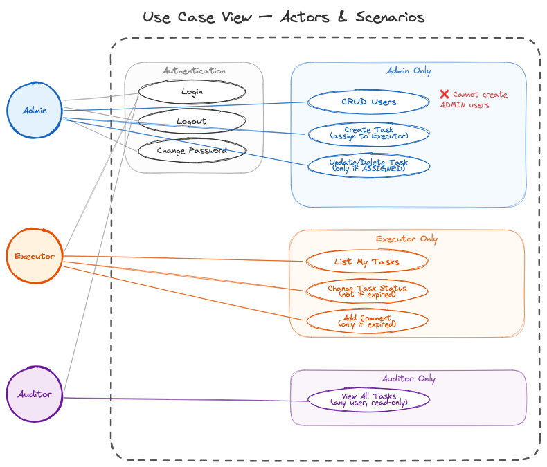
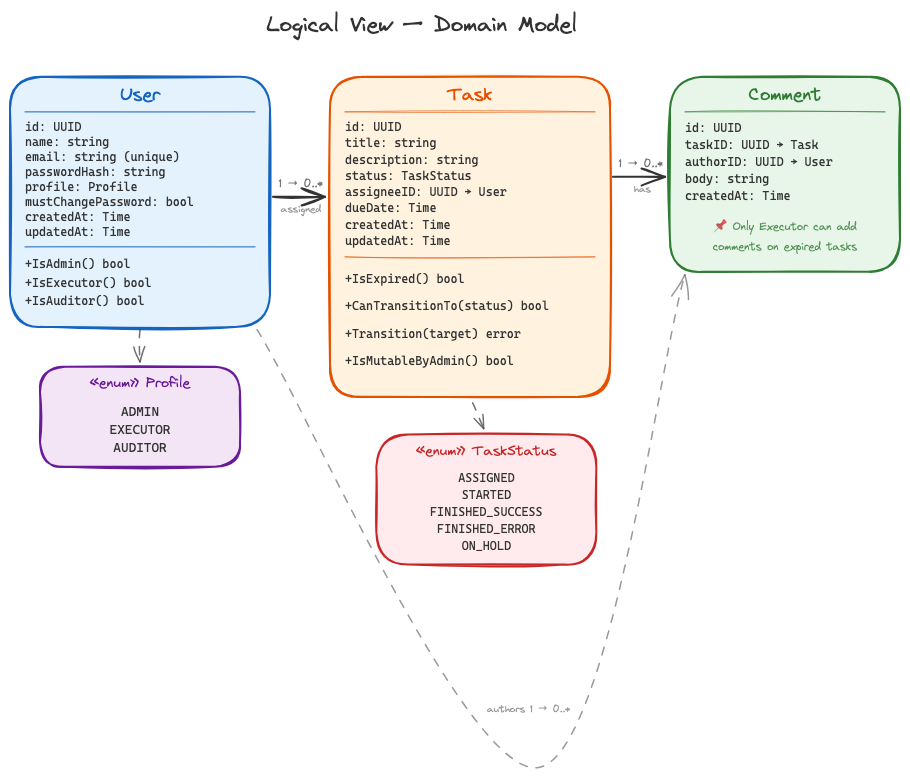
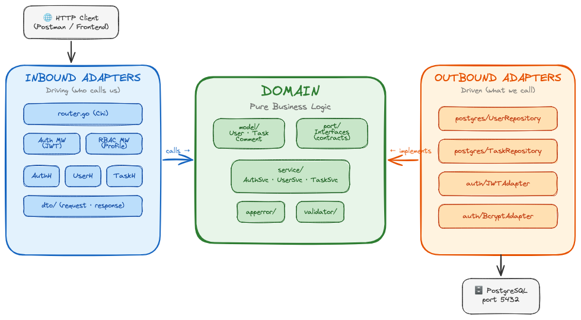
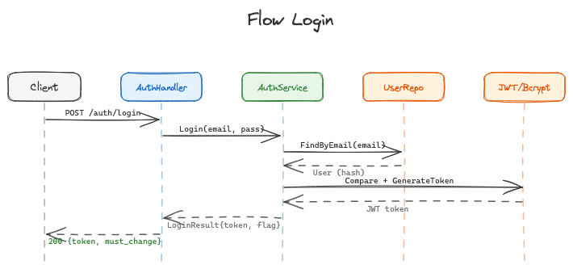
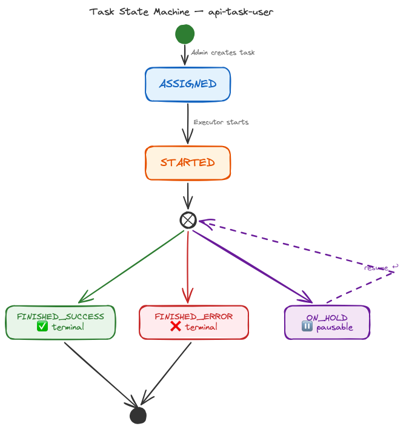
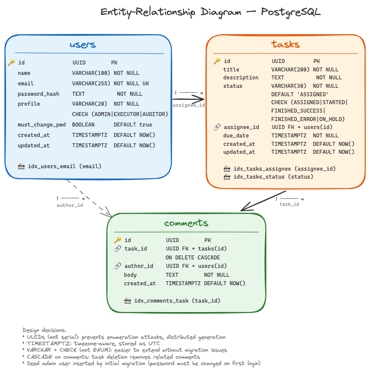

# Architecture Documentation — api-task-user

## Key Architectural Decisions

### 1. Hexagonal Architecture (Ports & Adapters)
The domain layer is completely isolated from infrastructure. External dependencies (HTTP, PostgreSQL) are abstracted behind port interfaces. This enables unit testing without infrastructure, swappable adapters, and a clear separation between business rules and delivery mechanisms.

### 2. Go with Chi
Go was chosen for its strong concurrency model, minimal runtime overhead, fast compilation, and static type system. Chi was selected as the HTTP router for its idiomatic middleware composition and stdlib compatibility (`net/http` handlers).

### 3. JWT-based Authentication with RBAC
Stateless authentication using JWT tokens that encode the user's profile in the claims. This eliminates the need for session storage and enables straightforward role-based access control at the middleware level.

### 4. State Machine in the Domain
Task state transitions are enforced by the `Task` entity itself — not by the database, not by the handler. This keeps business rules testable, centralized, and impossible to bypass.

### 5. TDD (Test-Driven Development)
All domain logic was developed test-first following the Red-Green-Refactor cycle. Ports enable mock injection for pure unit testing. Integration tests verify adapter implementations against real infrastructure.

---

## Scenarios (Use Cases)

> This view captures the system's functional requirements from the perspective of its actors. Each use case represents a meaningful interaction that delivers value.

### Actors

| Actor | Description |
|-------|-------------|
| **Admin** | Manages users and tasks. Cannot create other admins. |
| **Executor** | Performs assigned tasks, updates status and adds comments. |
| **Auditor** | Read-only access to all tasks for monitoring purposes. |

### Use Case Diagram

---

##  Logical View (Domain)

> This view describes the key abstractions in the system: entities, value objects, services and their relationships.

---

## Hexagonal Architecture

> This view describes the static organization of the software: packages, modules and their dependency relationships.

---

## Process View Login

> This view describes how components interact at runtime through sequence diagrams for the main flows.

---

## Task State Machine

> This diagram describes the lifecycle of a `Task` entity. State transitions are enforced by the domain layer (`Task.Transition()`).

### Business Rules

1. **Admin mutability**: Tasks can only be updated or deleted by an Admin while in `ASSIGNED` state. Once an Executor starts the task, it becomes immutable to the Admin.

2. **Expiration guard**: If `due_date < now()`, the Executor **cannot** change the task status. The state machine rejects the transition with `ErrTaskExpired`.

3. **Comment on expired**: Paradoxically, expired tasks **allow** the Executor to add comments — this is the mechanism for the Executor to explain why the task was not completed.

---

##Entity-Relationship

> PostgreSQL physical data model.

### Table Details

**users**

| Column | Type | Constraints |
|--------|------|-------------|
| id | UUID | PK, DEFAULT gen_random_uuid() |
| name | VARCHAR(100) | NOT NULL |
| email | VARCHAR(255) | NOT NULL, UNIQUE |
| password_hash | TEXT | NOT NULL |
| profile | VARCHAR(20) | NOT NULL, CHECK IN (ADMIN, EXECUTOR, AUDITOR) |
| must_change_password | BOOLEAN | NOT NULL, DEFAULT TRUE |
| created_at | TIMESTAMPTZ | NOT NULL, DEFAULT NOW() |
| updated_at | TIMESTAMPTZ | NOT NULL, DEFAULT NOW() |

*Indexes*: `idx_users_email` on `email`

**tasks**

| Column | Type | Constraints |
|--------|------|-------------|
| id | UUID | PK, DEFAULT gen_random_uuid() |
| title | VARCHAR(200) | NOT NULL |
| description | TEXT | NOT NULL |
| status | VARCHAR(30) | NOT NULL, DEFAULT 'ASSIGNED', CHECK IN (...) |
| assignee_id | UUID | NOT NULL, FK → users(id) |
| due_date | TIMESTAMPTZ | NOT NULL |
| created_at | TIMESTAMPTZ | NOT NULL, DEFAULT NOW() |
| updated_at | TIMESTAMPTZ | NOT NULL, DEFAULT NOW() |

*Indexes*: `idx_tasks_assignee` on `assignee_id`, `idx_tasks_status` on `status`

**comments**

| Column | Type | Constraints |
|--------|------|-------------|
| id | UUID | PK, DEFAULT gen_random_uuid() |
| task_id | UUID | NOT NULL, FK → tasks(id) ON DELETE CASCADE |
| author_id | UUID | NOT NULL, FK → users(id) |
| body | TEXT | NOT NULL |
| created_at | TIMESTAMPTZ | NOT NULL, DEFAULT NOW() |

*Indexes*: `idx_comments_task` on `task_id`

### Database Schema Design Decisions

1. **UUIDs over serial IDs**: Prevents enumeration attacks, allows distributed ID generation, no sequence contention.

2. **TIMESTAMPTZ over TIMESTAMP**: Stores timezone-aware timestamps. All times are UTC internally.

3. **CHECK constraints on enums**: Using VARCHAR with CHECK instead of PostgreSQL ENUM types. This avoids migration complexity when adding new values — `ALTER TYPE ... ADD VALUE` requires special handling in transactions.

4. **CASCADE on comments**: Deleting a task removes its comments. This is safe because only Admin can delete tasks, and only in `ASSIGNED` state (where no comments should exist yet).

5. **No soft deletes**: The spec does not mention restoring deleted entities. Hard deletes keep the schema simpler and the queries faster.
